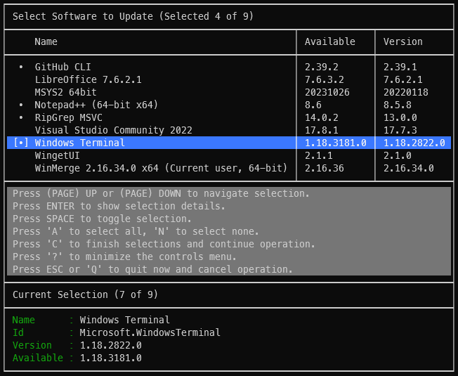
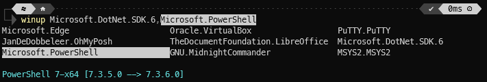
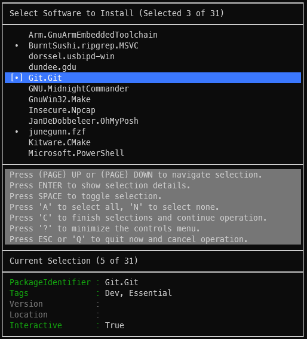
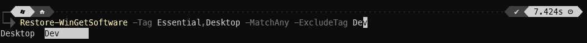

# WinGet-Essentials PowerShell Module


[](https://github.com/jjcarrier/WinGet-Essentials/actions/workflows/ci.yml)

## [Table of Contents](#table-of-contents)

* [Description](#description)
* [Installation](#installation)
* [Upgrading](#upgrading)
* [Update-WinGetSoftware](#update-wingetsoftware)
* [Checkpoint-WinGetSoftware](#checkpoint-wingetsoftware)
* [Restore-WinGetSoftware](#restore-wingetsoftware)
* [Initialize-WinGetIgnore](#initialize-wingetignore)
* [Initialize-WinGetRestore](#initialize-wingetrestore)
* [Merge-WinGetRestore](#merge-wingetrestore)
* [Additional Notes](#additional-notes)

## [Description](#table-of-contents)

Provides functionality for improved software management. This module includes
the following primary functionality:

* A simple CLI interface for `winget update`:
  * Ignore-Package support, via a `winget.{HOSTNAME}.ignore` file.
  * Tab-completion for locally-cached upgradable packages.
  * An interactive UI for selecting which packages to install.
  * Elevation option to instruct the tool to perform the install as an Administrator.
* A tag-based deployment tool:
  * Installation of suites of self-maintained tagged package-identifiers.
  * Elevation option to instruct the tool to perform the install as an Administrator.
  * A helper cmdlet to detect new package identifiers that have not yet been
    entered into `winget.packages.json`.
* A basic checkpoint command:
  * Takes a backup of the last checkpoint.
  * Saves a list of installed software with version info.
  * This is mostly an alias for `winget export --include-versions`.

## [Installation](#table-of-contents)

Download/install the module from [PSGallery](https://www.powershellgallery.com/packages/WinGet-Essentials):

```pwsh
Install-Module -Name WinGet-Essentials -Repository PSGallery
```

Add the module to your `$PROFILE`:

```pwsh
Import-Module WinGet-Essentials
```

For first time users, the following steps are recommended for setting up
the various resources needed by the cmdlets:

1. Open an Administrator instance of PowerShell
2. Change directory to a folder where you wish to store the physical copy of
   the resource files (i.e. the ignore and package list files).
3. Run:

   ```pwsh
   $ignoreFile = New-Item "winget.$((hostname).ToLower()).ignore"
   $packagesFile = New-Item "winget.packages.json"
   Initialize-WinGetIgnore -SourceFile $ignoreFile
   Initialize-WinGetRestore -SourceFile $packagesFile
   ```

4. Run the following which will capture the installed software available on
   WinGet and provide a UI to select what package IDs to add to the list of
   restorable packages. After making the selections the user will be prompted
   to tag each of these packages. The `-MergeAll` switch skips a follow up
   confirmation after the selections have been made from the UI:

   ```pwsh
   Merge-WinGetRestore -UseUI -MergeAll
   ```

5. Finally, for any of the packages you opt'd not to add to `winget.packages.json`
   consider adding these to the ignore file that was just created (each entry
   should be on its own line).

With the above steps in place, the majority of this module's cmdlets can
generally be used without administrator privileges, but for installation of
packages, this will depend on the particular package and whether they support
elevation of permissions.

## [Upgrading](#table-of-contents)

### For module versions >= 1.6.1

To upgrade from a previously configured installation to a newer release of the
module, in an Administrator instance of PowerShell, run:

```pwsh
Update-WinGetEssentials
```

### Alternative update method (for module versions < 1.6.1)

If desired, it is also possible to perform a more manual upgrade process using
`Update-Module` as shown below and performing the additional actions outlined
in the paragraphs that follow.

```pwsh
Update-Module -Name WinGet-Essentials -Repository PSGallery
```

> [!NOTE]\
> If the `WinGet-Essentials` module is already loaded, restart the terminal or
  reload the module explicitly via `Remove-Module` followed by `Import-Module`.

After `Upgrade-Module` completes, it is advisable to run the following commands
in an administrator PowerShell instance to allow new symbolic links to be
created. Some cmdlets will attempt to perform this automatically, but it will
only be possible to create a SymLink if the cmdlet is running in an
administrator PowerShell instance.

```pwsh
Initialize-WinGetIgnore
Initialize-WinGetRestore
```

It may also be desirable to run the following to have other resources/functions
ready to use (such as tab-completion for package IDs with
`Update-WinGetSoftware` or use of `Restore-WinGetSoftware`):

```pwsh
Checkpoint-WinGetSoftware
Update-WinGetSoftware -Sync
```

> [!NOTE]\
> The commands above will find the previous module install to determine where
  the resource files reside. If no such files existed, then it will be necessary
  to provide the `-SourceFile` parameter to the associated cmdlets.

## [Update-WinGetSoftware](#table-of-contents)

Provides a basic UI for updating software available in a WinGet repository.

### Aliases

* `winget-update`
* `winup`

### Usage

To selectively install updates using a simple UI run:

```pwsh
Update-WinGetSoftware
```



To install a specific package run (supports tab-completion for cached updatable package IDs):

```pwsh
Update-WinGetSoftware <WinGetPackageID>[,<AnotherWinGetPackageID>]
```



To update the cached list of upgradable package IDs, run:

```pwsh
Update-WinGetSoftware -Sync
```

## [Checkpoint-WinGetSoftware](#table-of-contents)

Stores a snapshot of installed software, including versions. This can be used
by WinGet natively to reinstall the listed software. This cmdlet's output
is also needed by other functionality of this module, namely `Merge-WinGetSoftware`
and `Restore-WinGetSoftware` (when using the `-NotInstalled` switch).

The checkpoint file and its backup are stored in the same path that this module
resides in. This path may for instance be:

`$env:USERPROFILE\Documents\PowerShell\Modules\WinGet-Essentials\<MODULE_VERSION>\modules`

> [!WARNING]\
> `Uninstall-Module` will indiscriminately remove files in the associated
  module's directory. Consider moving these files to another location. A future
  version of this module will likely provide a user-configurable way to redirect
  this file to other locations.

### Aliases

* `winget-checkpoint`

### Usage

```pwsh
Checkpoint-WinGetSoftware
```

## [Restore-WinGetSoftware](#table-of-contents)

Restores a set of software packages based on a locally, user-managed,
`winget.packages.json` (see `Initialize-WinGetRestore` section below for details
on initializing this file).

The set of packages to be installed/restored is determined by tags. The tags
can be used in two ways: `AND-comparison` or `OR-comparison`. This is determined
by the `-MatchAny` switch parameter (default behavior is to `Match All` tags).
This cmdlet supports tab completions for the user-defined tags found in the
`winget.packages.json` file. A `-NotInstalled` switch can be specified which
will filter out package IDs that are found in the current `checkpoint` file
generated from `Checkpoint-WinGetSoftware`.

### Aliases

* `winget-restore`

### Usage

Example: All packages containing both "Dev" and "Essential" tags will
be presented in a UI for user refinement of which packages to install.

```pwsh
Restore-WinGetSoftware -Tag Dev,Essential -UseUI
```



Example: Install all packages tagged with any of the following: "Essential",
"Desktop" but not containing "Dev".

```pwsh
Restore-WinGetSoftware -Tag Essential,Desktop -MatchAny -ExcludeTag Dev
```



## [Initialize-WinGetIgnore](#table-of-contents)

A helper for initializing an instance of `winget.{HOSTNAME}.ignore` for the
current module version. This cmdlet is also called internally by the cmdlets
to attempt automatic migration of previous `winget.{HOSTNAME}.ignore`
instances to the current version.

### Adding PackageIdentifiers to the ignore list

To ignore a specific package from appearing in the various supported cmdlets,
the software package's corresponding `PackageIdentifier` (as indicated by the
`winget` command) is to be added to a new line entry in the associated
`winget.{HOSTNAME}.ignore`. Each line should contain a single winget package ID
(verbatim).

> [!NOTE]\
> At this time, wild cards are not supported, but may be introduced in a future
  update.

### Usage

With a `winget.{HOSTNAME}.ignore` run the following command in an
__Adminstrator__ PowerShell:

```pwsh
Initialize-WinGetIgnore -SourceFile .\winget.{HOSTNAME}.ignore
```

> [!NOTE]\
> The `{HOSTNAME}` section should be replaced with the name of the computer as
  determined by the `hostname` command. Technically, the name of this source
  file may be given any name so long as it is symbolically linked, however
  this naming scheme is used to support a centralized cloud backup location
  where multiple ignore files exist targeting different computers.

> [!WARNING]\
> While it is possible to have a hard copy of this ignore file placed in
  the module folder, it is recommended to use this cmdlet so that a
  symbolic link is used. This is to avoid accidental deletion during
  `Uninstall-Module`. It also reduces maintenance issues by allowing one
  copy of the file to be used across multiple versions of the module (assuming
  there are no compatibility issues between the versions).

## [Initialize-WinGetRestore](#table-of-contents)

A helper for initializing an instance of `winget.packages.json` for the current
`Restore-WinGetSoftware` cmdlet. The `Initialize-WinGetRestore` cmdlet is also
called internally by `Restore-WinGetSoftware` to handle migrating previous
`winget.packages.json` instances to the current version.

When using this `Restore-WinGetSoftware` for the first time, the user needs
to manually create/define this JSON file and ideally, create a SymLink to it
(see the [Installation](#installation) section above for details).
This for instance, may be placed in a cloud backup folder that syncs between
computers so that the package list is shared between multiple systems that
are to have similar software packages installed.

### Setup of winget.packages.json

This JSON file is to contain an array of objects describing each package of
interest. It should, at a minimum, have the following form:

```json
[
  {
    "PackageIdentifier": "<WINGET_PACKAGE_ID1>",
    "Tags": [
      "<MY_TAG1>",
      "<MY_TAG2>",
    ]
  },
  {
    "PackageIdentifier": "<WINGET_PACKAGE_ID2>",
    "Tags": [
      "<MY_TAG1>",
      "<MY_TAG3>",
    ]
  }
]
```

### Optional JSON keys

Each entry above may specify various optional key-values which include:

* Install Location
* Package Version
  * Both weak and strong version locking can be specified through the inclusion
    or omission of the `VersionLock` key.
* Interactive Install
  * Force the install command for a specific `PackageIdentifier` to always
    include `--interactive`. This remains true even `-Force` is specified.
* Additional Arguments
  * Arguments may be passed directly to `winget` to expose all other command
    options that have not been specifically supported by this JSON format.
* Post-installation Commands
  * Supports execution with various control options (error handling/prompts).

Further details available in [packages.schema.json](WinGet-Essentials/modules/schema/packages.schema.json)

### JSON validation

When editing the `winget.packages.json` file, a user may use the available
schema-file for assistance and validation. The following entry may be added
(replacing `<PATH_TO_MODULE>` with the location to the installed
`WinGet-Essentials` module) to a VS Code's user/workspace settings (assuming the
file is given the default name of `winget.packages.json`):

```json
"json.schemas": [
    {
        "fileMatch": [
          "/winget.packages.json"
        ],
        "url": "<PATH_TO_MODULE>/modules/schema/packages.schema.json"
    }
]
```

### Fake Packages (EXPERIMENTAL)

> [!NOTE]\
> Behavior is subject to change in the future.

As a side-effect of adding CI testing, there was a need to create a _fake_
`PackageIdentifier` as a way to skip potentially lengthy `winget` install
requests during test execution and to allow more control over how test execution
flows through the PowerShell logic. A `PackageIdentifier` following the form,
`<*>` will be detected as _fake_ (where * is a wildcard and represents the
user-defined name of the _fake_ package):

Because of this, it is possible to specify `winget.packages.json` entries
that do not point to a software package to install, rather a series of
commands/scripts via the `PostInstall` functionality. However, one current
limitation of this feature is there is no guarantee that `-NotInstalled` will
work correctly for these packages as they exist outside the scope of `winget`.

While it is certainly handy to provide a unified way to download all tools via
one interface, the current advice is to __use this feature sparingly__.

### Example PostInstall Entry

Below is an example entry for installing `python` (version 3.11) from `winget`
and disabling the `winstore` aliases during post-installation. If an error
occurs during install or during post-install command execution the user will be
prompted.

```json
  {
    "PackageIdentifier": "Python.Python.3.11",
    "Tags": [
      "Dev",
      "Essential"
    ],
    "PostInstall": {
      "Commands": [
        "Remove-Item \"$env:LOCALAPPDATA\\Microsoft\\WindowsApps\\python.exe\"",
        "Remove-Item \"$env:LOCALAPPDATA\\Microsoft\\WindowsApps\\python3.exe\""
      ],
      "Run": "OnSuccess",
      "OnError": "Prompt"
    }
  }
```

### Usage

With a `winget.packages.json` created run in an __Adminstrator__ PowerShell:

```pwsh
Initialize-WinGetRestore -SourceFile .\winget.packages.json
```

## [Merge-WinGetRestore](#table-of-contents)

A helper for detecting package IDs installed on the host system that are not
present in `winget.packages.json`. This cmdlet will confirm with the user
whether or not to add the package to the file. If added, the user will also
be asked what tags to assign the package (if any).

### Usage

Running the command below on two or more systems sharing the same
`winget.packages.json` (i.e. via file sync / cloud storage solutions) will allow
the user to easily create a superset of software package IDs.

```pwsh
Merge-WinGetRestore
```

## [Additional Notes](#table-of-contents)

One feature that might be missing from a tool containing the word `Essentials`
is a tab-completion interface for winget itself. This is currently left out of
this module, but may be included in the future as an optional function to invoke,
in any case this is a trivial feature to add and is well-documented by Microsoft here:

[Microsoft Learn: WinGet Tab Completion](https://learn.microsoft.com/en-us/windows/package-manager/winget/tab-completion)

Other code repositories provide suites of tab-completion support for various
commands such as:

[PS-TabCompletions Git Repository](https://github.com/jjcarrier/PS-TabCompletions)
